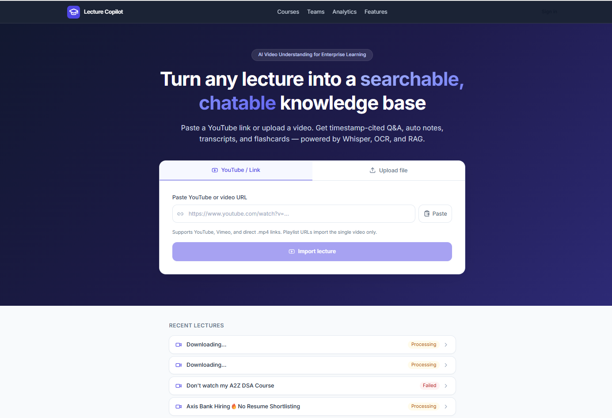
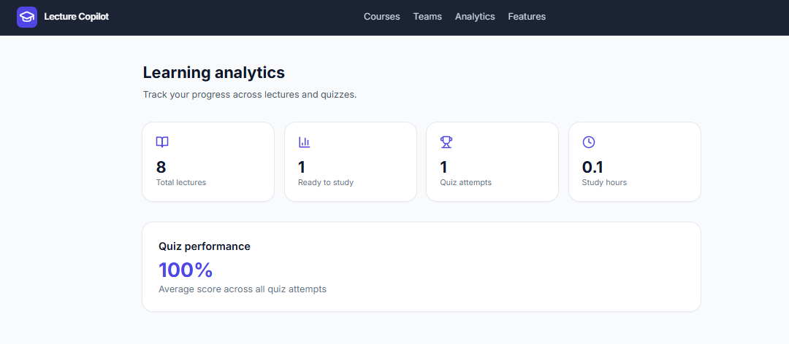

# Lecture Copilot
Live Deployment at  https://lecture-copilot-api.onrender.com/


Upload a lecture video → get timestamp-cited Q&A, auto notes, flashcards, quizzes, and more.

## Quick start (Windows, no Docker)

```powershell
cd lecture-copilot
.\scripts\setup.ps1      # install deps (first time)
.\scripts\start.ps1      # opens backend + frontend
```
# 📸 Application Screenshots

## 📊 Dashboard



---

## 🎓 Create Courses


---

## 🤖 AI Lecture Copilot Features


---

## 📈 Learning Analytics



---
Open **http://localhost:3000**

### Prerequisites

1. **Python 3.11+**
2. **Node.js 18+**
3. **ffmpeg** — required for video/audio processing
4. **(Optional) Tesseract OCR** — for reading slide text

### API keys (add to `.env`)

| Key | Purpose |
|-----|---------|
| `GROQ_API_KEY` | Fast Whisper transcription |
| `ANTHROPIC_API_KEY` | Q&A, notes, flashcards, quizzes, vision, translation |
| `VOYAGE_API_KEY` | Better hybrid search embeddings |

Copy `.env.example` to `.env` and fill in your keys locally. **Never commit `.env` to GitHub.**

### Sharing on GitHub (keep secrets safe)

- `.env` and `frontend/.env.local` are **gitignored** — they stay on your machine only
- Only `.env.example` is committed (empty placeholders, no real keys)
- Do **not** paste API keys in issues, PRs, or README
- If a key is ever exposed, **revoke it** at [console.anthropic.com](https://console.anthropic.com) and create a new one

```powershell
copy .env.example .env   # first-time setup
# edit .env with your keys, then never git add .env
```

## Features

| Feature | Description |
|---------|-------------|
| **Auth** | Email/password register & login (`/login`) |
| **Courses** | Group lectures, cross-lecture Q&A (`/courses`) |
| **Teams** | Shared workspaces with members (`/teams`) |
| **Hybrid RAG** | Vector + BM25 search for better Q&A |
| **Smart chapters** | LLM-named chapter titles |
| **Vision AI** | Claude describes slide frames |
| **Slide extraction** | Auto-detect and save slide images |
| **Quizzes** | Auto-generated MCQs with scoring |
| **Annotations** | Bookmarks, highlights, notes on timestamps |
| **Export** | SRT, Markdown notes, Anki CSV |
| **SSE progress** | Live processing updates |
| **Analytics** | Study hours, quiz scores (`/analytics`) |
| **LMS hooks** | Canvas, Moodle, Google Classroom stubs |
| **Audit logs** | Compliance action logging |
| **Translation** | Multilingual Q&A answers |

## Architecture

```
Video upload / YouTube import
    ├── Whisper transcription
    ├── Smart chapter detection + LLM naming
    ├── OCR + slide extraction
    ├── Vision summaries (Claude)
    └── Speaker labeling
           ↓
    Hybrid index (vector + BM25)
           ↓
    Q&A · Notes · Flashcards · Quizzes · Slides
```

## API endpoints

- `POST /auth/register` · `POST /auth/login`
- `POST /videos/upload` · `POST /videos/import-url`
- `POST /chat` (video_id or course_id)
- `GET /courses` · `POST /courses/{id}/videos`
- `GET /quizzes/{video_id}` · `POST /quizzes/submit`
- `GET /annotations/{video_id}` · `POST /annotations`
- `GET /export/{video_id}/transcript.srt` · `notes.md` · `anki.csv`
- `GET /events/videos/{id}/stream` (SSE)
- `GET /analytics` · `GET /lms/providers`

Docs: http://localhost:8010/docs
